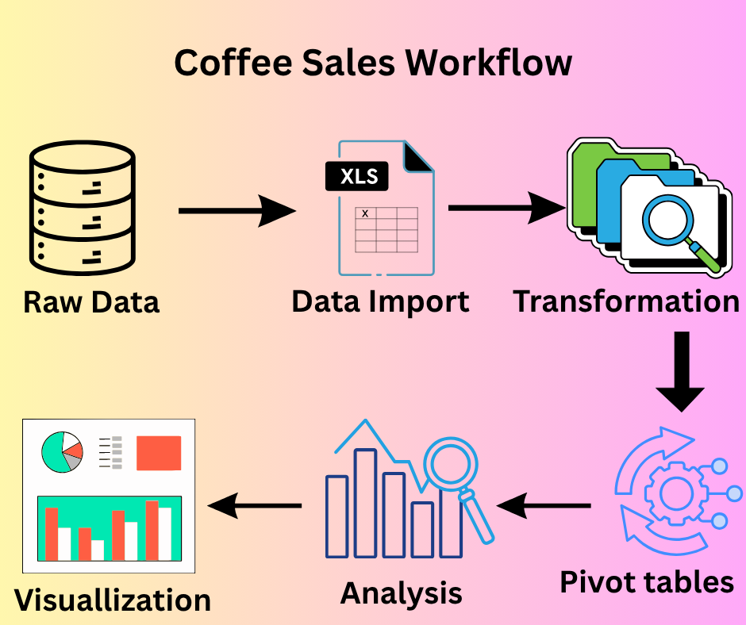

# Coffee Sales Analytics Dashboard ☕

## 📌 Project Overview
This project analyzes transaction records for a coffee shop operating across multiple New York City locations. The dataset contains transaction dates, timestamps, store locations, and product-level details.  
The goal is to uncover sales trends, customer behavior patterns, and product performance through data analysis and visualization.

---
## Workflow Diagram
This workflow turns raw coffee sales data into actionable business insights using Excel, Power Query, pivot tables, and dashboards.
---

## 📊 Dashboard Preview

---

## 📊 Key Questions
- How have sales trended over time?  
- Which days of the week are busiest, and why?  
- What times of day are most popular? Do trends differ by location?  
- Which products sell the most and least?  
- Which products drive the most revenue for the business?  

---

## 🛠 Tools Used
- Excel → Data cleaning, analysis, Power Query, and dashboard creation  
- Pivot Tables & Charts → Trend analysis and comparisons  
- Conditional Formatting → Highlighting key insights  

---

## 📈 Findings

### Astoria
- Transactions steadily increase from 7 AM to 10 AM, with 10 AM being the peak hour.  
- After 10 AM, sales slightly drop but remain moderate until around 7 PM.  
- Monday, Thursday, and Friday recorded the highest daily sales.  
- June achieved the highest monthly sales.  

### Hell’s Kitchen
- Sales begin early from 6 AM to 8 AM, dip slightly at 9 AM, then rise again at 10 AM before declining later in the evening (around 8 PM).  
- Friday and Tuesday were the strongest sales days.  
- June recorded the highest sales.  

### Lower Manhattan
- Transactions increase from 6 AM to 10 AM, with 10 AM being the peak sales hour.  
- A significant drop is observed later in the evening around 8 PM.  
- Monday recorded the highest daily sales.  
- June also had the highest sales.  

### Overall (All Stores)
- Friday recorded the highest sales across all stores, followed by Thursday and Monday.  
- Tuesday and Wednesday showed moderate sales levels.  
- June was the peak sales month, with May, April, and March also performing well.  
- January and February saw comparatively lower sales.  

### Top 10 Products
- Best-performing products included: Barista Espresso, Gourmet Brewed Coffee, Brewed Chai Tea, and others consistently driving sales.  

---

## 📊 Findings & Recommendations

### Astoria
- **Finding:** Sales peak between 7 AM – 10 AM, especially on Mondays, Thursdays, and Fridays. June had the highest sales.  
- **Recommendation:** Focus on staffing and promotions during morning peak hours (7–10 AM). Plan weekly offers or loyalty discounts on Mondays, Thursdays, and Fridays to maximize sales.

### Hell’s Kitchen
- **Finding:** Strong sales between 6–10 AM with slight dips after 9 AM. Best sales days were Friday and Tuesday.  
- **Recommendation:** Run “morning rush” promotions to capture consistent early traffic. Strengthen marketing on Tuesdays and Fridays to balance sales across the week.

### Lower Manhattan
- **Finding:** Peak sales at 10 AM and busiest day is Monday. June had the highest performance.  
- **Recommendation:** Invest in Monday promotions to sustain momentum. Encourage evening deals (e.g., 20% off after 6 PM) to stabilize sales throughout the day.

### Overall (All Stores)
- **Finding:** Fridays generate the most sales, followed by Thursdays and Mondays. June is the strongest month; Jan–Feb are weaker months.  
- **Recommendation:** Focus marketing campaigns and staff allocation on Fridays. Run seasonal campaigns in Jan–Feb to lift sales. Use June to launch new product campaigns.

### Top 10 Products
- **Finding:** Drinks like Barista Espresso, Gourmet Brewed Coffee, and Brewed Chai Tea dominate sales.  
- **Recommendation:** Promote these top-sellers through bundles (e.g., Coffee + Pastry) and upselling. Encourage underperforming products with targeted discounts to diversify sales.

---

## 🚀 How to Use
1. Download the Excel file from this repository  
2. Open in Microsoft Excel  
3. Explore the interactive dashboard and pivot reports  

---

